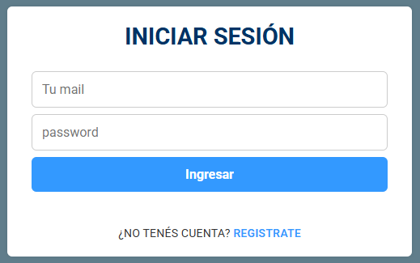
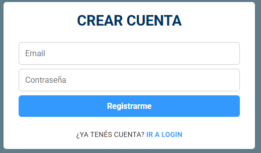

# 🎨 Arte Marketplace [--> link preview](https://gustaboin.github.io/artmarket/)

Un **marketplace de arte digital** hecho en **React**.  
Permite explorar obras destacadas, ver detalles en un **modal** o página dedicada, agregar productos a un **carrito de compras** y finalizar con un **checkout** (simulado).


---

## ✨ Características

- 📌 **Listado de obras** con diseño moderno y responsivo.

- 🖼️ **Modal rápido** con descripción, imagen y botón de compra.


- 🔍 **Página de detalle** para cada obra.

- 🛒 **Carrito de compras**:
  - Agregar y eliminar productos.
  - Control de cantidades (+ / -).
  - Subtotales y total dinámico.
  - Persistencia en `localStorage`.


- 💳 **Checkout simulado**:
  - Formulario con validaciones realistas.
  - Limpieza del carrito al completar la compra.


- 📱 **Responsive design**: adaptado a mobile y desktop.


- 🎚️ **Carrusel de productos** con navegación lateral.

---

## 🚀 Tecnologías utilizadas

- [React](https://react.dev/) + [Vite](https://vitejs.dev/)
- [React Router](https://reactrouter.com/) para la navegación
- Context API para el **estado global del carrito**
- [React Modal](https://www.npmjs.com/package/react-modal) para el popup de producto
- CSS puro con **media queries** para mobile-ready

---

## 📂 Estructura del proyecto


## Mejoras agregado de Iniciar Sesion y Registrarse

con la utilizacion de Localstorage en utils/UserStorage guardo los usuarios en Userdb en el localstorage

### Login



### Registro



## Bonus fondo de pantalla x inactividad (Component Screensaver)

A los 30 segundos de inactividad se va mostrar un array con palabras relacionadas al arte, se puede cambiar el tiempo de inactividad


## 📦 Instalación y uso

Cloná este repo:

```bash
git clone https://github.com/tuusuario/art-marketplace.git

```

```bash

cd art-marketplace

npm install

npm run dev

Abrí en tu navegador >> http://localhost:5173

```

## Librerias instaladas

```bash

npm install react-router-dom

npm install --save react-modal

npm install react-icons

npm install react-rating-stars-component
```

## Visualiza el proyecto

- **[ArtMarket](https://gustaboin.github.io/artmarket/)** - Una Divertida App de Arte para que puedas vender tus obras! 🌐
